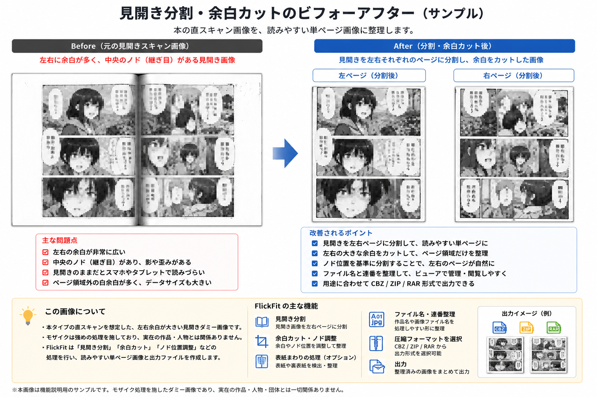

# FlickFit



**バージョン 1.0.1**（2026-05-07）— 変更履歴は [CHANGELOG.md](CHANGELOG.md) を参照。

**漫画をスマホやサーバ向けビューアで読みやすくする画像前処理ツール**（見開き分割・余白・表紙まわりの自動化）。

主な想定: **Kavita** / **Komga** 向けに、フォルダ内の画像を整理・分割・出力します。

---

## 必要な環境

外部ツールは次の三層に分けています。

### 最低限これだけで動く

- **OS**: Windows 10/11
- **PowerShell**: **PowerShell 7（pwsh）推奨**
  ※ 無い場合は Windows PowerShell 5.1 でもランチャーは起動可
- **Python**: 3.x
  必要ライブラリ: Pillow / OpenCV / NumPy

```bash
pip install pillow opencv-python numpy
```

※ 未導入時はメイン処理が案内します

### あれば便利

- **WinRAR**: **RAR 形式**を出すときに必要。**ZIP / CBZ** だけなら無くても PowerShell の ZIP 作成で足ります（下記）
  ※ 画像処理（Python）自体には不要

### なくてもOK

- **WinRAR 未インストール**: ランチャーは警告のうえ**続行可能**。**ZIP / CBZ** は WinRAR なしでも、PowerShell 組み込みの **`Compress-Archive`（標準 ZIP 形式）**で出力されます。**RAR 形式だけ** WinRAR が無いと作成できません

---

## 使い方（3ステップ）

1. **このフォルダ一式**を好きな場所に置く
2. **`FlickFit.bat` をダブルクリック**してランチャーを開く  
   配布物の**正式起動口は `FlickFit.bat` のみ**です。旧 VBS 起動（`FlickFitLaunch.vbs`）は**廃止**しているため、VBS では起動しません。環境によっては起動時に**コマンド画面（cmd）が一瞬表示される**ことがあります（`cmd.exe` の点滅は BAT 経由の制約上、完全には避けにくいです。PowerShell の**黒窓**とは別の現象です）。**PowerShell コンソール**はランチャー起動直後に自動で隠す想定で、**黒窓が固まって残る**ことは想定していません。
3. **作品フォルダ（解凍済み）を選んで実行**

👉 まずは1つの作品フォルダで試すのがおすすめです

メイン処理は **別の PowerShell ウィンドウ**で動きます。
詳細ログはそのウィンドウで確認してください。

---

## 出力の場所

既定: 作品フォルダ直下の **`_output`**（`UserConfig.json` で変更可）

---

## 設定

- **`UserConfig.json`**（ルート直下）を優先
- 無い場合は **`Modules\UserConfig.json`** を参照

例:

- `Modules\UserConfig.example.json` をコピーして `UserConfig.json` を作成（キー一覧の参照にも使えます）

### CompressionFormat（圧縮出力形式）

メイン処理の **STEP6 で書き出すアーカイブ形式**です。`UserConfig.json` の文字列（大文字小文字は正規化されます）。

- 許可値: **`CBZ`**（既定） / **`ZIP`** / **`RAR`**
- 未定義・空・上記以外は **`CBZ`** として扱います
- **CBZ / ZIP**: WinRAR なしでも PowerShell の `Compress-Archive` 系で作成できます
- **RAR**: **WinRAR** が必要です（未インストールでもランチャー「詳細オプション…」では選べますが、実行時に失敗します。`WinRAR` キーに `WinRAR.exe` のフルパスを書くこともできます）

ランチャーの **「詳細オプション…」** から ComboBox で選ぶと、ルートの `UserConfig.json` に `"CompressionFormat": "CBZ"` のように保存されます（既存の `Modules\UserConfig.json` のみの場合も、書き込み先はルートに作成されます）。

`Modules\UserConfig.example.json` に `CompressionFormat` の例があります。

ログやスクリーンショットを第三者に見せる前に、コンソール表示のフルパス短縮や NG 語の伏せ字を有効にできます。

- **`PublicMode`**: `true` にすると表示用ログへマスク処理がかかります（内部のパス比較・判定には使いません）。
- **`NgWords`**: 文字列の配列。部分一致（大文字小文字無視）でログ表示から伏せます。圧縮出力のフォルダ名（ベース名）の安全化にも使われます。

コンソール向けは **`Write-FlickFitHost`** / **`Write-FlickFitWarning`** および **`Read-HostWithEsc` のプロンプト表示**がマスク対象です。一方で、次の経路はマスクされずに出ることがあるため、公開前には実ログでも確認してください。

- **`throw` のメッセージ**や **コンソールにそのまま出る外部プロセスの出力**
- **Python の標準出力**（キャプチャしない経路やデバッグ行）

`Modules\UserConfig.example.json` にキー例があります。

---

### 生画像（JPG / PNG / AVIF 等）について

作業フォルダ直下などに置いた**元の画像ファイルは、自動では削除しません**（アーカイブ解凍由来や変換パイプライン側は別処理）。共有ログ用マスクとは別に、元データの消失リスクを抑える方針です。

---

### VolumePatternOverrides.json について

必要に応じて `VolumePatternOverrides.example.json` をコピーし、
`VolumePatternOverrides.json` として使用します。具体語の参考として **`VolumePatternOverrides.legacy-example.json`**（個人用・公開 ZIP 非推奨）もあります。

- `source_prefixes.chapter`
- `source_prefixes.volume`
- `sanitize_source_noise_patterns`
- `cover_folder_name_tokens_extra`（表紙**フォルダ名**用の**追加**トークン。ここに書いた名が**最優先1段**で候補に乗る。空なら `cover` / `表紙` / `カバー` 等の汎用のみ。具体語の例は `VolumePatternOverrides.legacy-example.json` を参照。）

に任意のパターンを追加できます。

これらは**内蔵の汎用に追加マージ**され、
**JSON を作らない既定でも** `cover/表紙/カバー` 等で動作します。

👉 配布系・配布元固有の **フォルダ名**・プレフィックス等は、本体ではなくここに分離する想定です

---

### 配布 ZIP に含めないもの（衛生）

次はローカル環境や実行履歴が混ざりやすいため、**公開配布物からは除く**ことを推奨します。

- `*.pyc` / `__pycache__`
- `.jxl-plugin-cache.json`（Python 実体パス等が入ることがあります）
- `launcher_trace.log`
- `VolumePatternRules.local.txt`（個人用ルール）

プロジェクト直下の `.gitignore` にも同様のパターンを入れています。

**既に Git で追跡しているファイル**は ignore だけでは索引から消えません。リポジトリから外す例（パスは環境に合わせて調整）:

```powershell
git rm --cached .jxl-plugin-cache.json
git rm --cached Modules/.jxl-plugin-cache.json
git rm --cached launcher_trace.log
git rm --cached VolumePatternRules.local.txt
```

`*.pyc` や `__pycache__` は、該当ファイルを `git ls-files` で確認してから個別に `git rm --cached` するのが確実です（ワイルドカードはシェルによって解釈が異なります）。

---

## よくある状況

| 状況             | 対処                                   |
| -------------- | ------------------------------------ |
| Python が見つからない | python.org からインストール or `py` を PATH に |
| 途中で止まった        | `_process_log.json` から再開可能           |
| GUI が出る        | 分割や余白の確認が必要なケース                      |

---

## ファイル構成（抜粋）

```
FlickFit.bat              ← 起動
FlickFitLauncher.ps1      ← ランチャー
FlickFit-Core.ps1 ← メイン処理
Modules\                  ← 共通処理・設定
tests\fixtures\           ← テスト用
```

---

## ライセンス・免責

利用規約はリポジトリ方針に従ってください。
入力データのバックアップは自己責任で行ってください。
